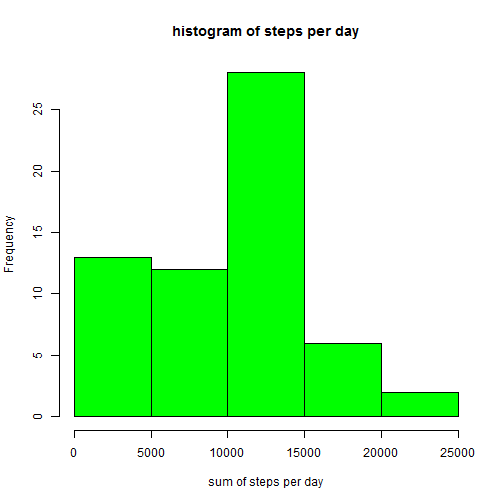
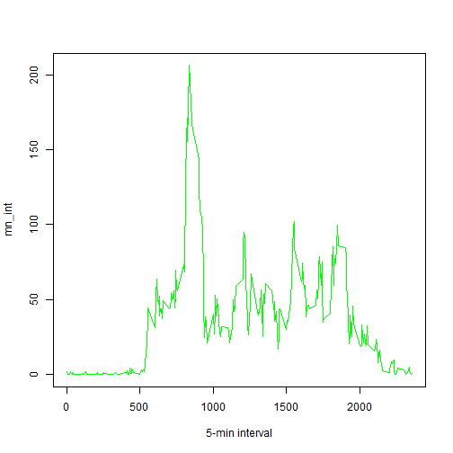
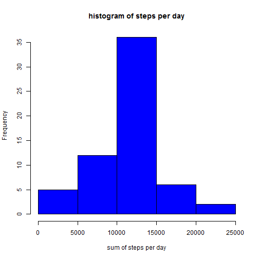

##Data 
The data for this assignment can be downloaded from the course web site.

  The variables included in this dataset are:

  steps: Number of steps taking in a 5-minute interval (missing values are coded as NA)

  date: The date on which the measurement was taken in YYYY-MM-DD format

interval: Identifier for the 5-minute interval in which measurement was taken


The dataset is stored in a comma-separated-value (CSV) file and there are a total of 17,568 observations in this dataset.

#Loading the Data

```r
activity <- NULL
activity <- read.csv("activity.csv", header = T, sep = ",")
```

Variables to be used for the analysis

```r
df_summary <- NULL
su2 <- NULL
su <- NULL
mn_int <- NULL
activity2 <- NULL
mean_su2 <- NULL
median_su2 <- NULL
activity2_weekend <- NULL
activity2_weekday <- NULL
mean_activity2_weekday <- NULL
mean_activity2_weekend <- NULL
```

##What is mean total number of steps taken per day?

```r
su <- tapply(activity$steps, activity$date, sum, na.rm=T)
hist(su,col ='green' ,xlab = "sum of steps per day", main = "histogram of steps per day")
```



The mean and the median total number of steps taken per day are reported :

```r
mean_su <- round(mean(su))
median_su <- round(median(su))

print(c("The mean is",mean_su))
```

```
## [1] "The mean is" "9354"
```

```r
print(c("The median is",median_su))
```

```
## [1] "The median is" "10395"
```
##what is the average daily activity pattern ?
A time series plot of the 5-minute interval and the average number of steps taken (averaged across all days) is shown below:

```r
mn_int <- tapply(activity$steps, activity$interval, mean, na.rm=T)
plot(mn_int ~ unique(activity$interval), col='green',type="l", xlab = "5-min interval")
```


The 5-minute interval (on average across all the days in the dataset) that contains the maximum number of steps is the following (below are shown the interval showing the max. number of steps and the value of the max. number of steps):

```r
mn_int[which.max(mn_int)]
```

```
##      835 
## 206.1698
```
##Imputing missing values
Note that there are a number of days/intervals where there are missing values (coded as NA). The presence of missing days may introduce bias into some calculations or summaries of the data.

First, in order to visualize in which variable the NAs are:

```r
table(is.na(activity) == TRUE)
```

```
## 
## FALSE  TRUE 
## 50400  2304
```

```r
summary(activity)
```

```
##      steps                date          interval     
##  Min.   :  0.00   2012-10-01:  288   Min.   :   0.0  
##  1st Qu.:  0.00   2012-10-02:  288   1st Qu.: 588.8  
##  Median :  0.00   2012-10-03:  288   Median :1177.5  
##  Mean   : 37.38   2012-10-04:  288   Mean   :1177.5  
##  3rd Qu.: 12.00   2012-10-05:  288   3rd Qu.:1766.2  
##  Max.   :806.00   2012-10-06:  288   Max.   :2355.0  
##  NA's   :2304     (Other)   :15840
```
All of the NA's are in the steps variable. There are 2304 NA's.

##Strategy for filling in all of the missing values in the dataset
The following strategy is chosen: for any NA is the step variable, the mean (of steps) of the corresponding interval is taken as the replacing value.

The 'mn_int' contains the mean for each single interval calculated over the 61 days. The right value coming from 'mn_int' is going to be used to replace the NA at the same interval.


```r
activity2 <- activity  # creation of the dataset that will have no more NAs
for (i in 1:nrow(activity)){
    if(is.na(activity$steps[i])){
        activity2$steps[i]<- mn_int[[as.character(activity[i, "interval"])]]
    }
}
#Below is a histogram of the total number of steps taken each day. The mean and median total number of steps taken per day are reported.
su2 <- tapply(activity2$steps, activity2$date, sum, na.rm=T)
hist(su2,col='blue' ,xlab = "sum of steps per day", main = "histogram of steps per day")
```



```r
mean_su2 <- round(mean(su2))
median_su2 <- round(median(su2))
```
New Values are 

```r
print(c("The mean is",mean_su2))
```

```
## [1] "The mean is" "10766"
```

```r
print(c("The median is",median_su2))
```

```
## [1] "The median is" "10766"
```
In order to compare the new values with the "old" values:

```r
df_summary <- rbind(df_summary, data.frame(mean = c(mean_su, mean_su2), median = c(median_su, median_su2)))
rownames(df_summary) <- c("with NA's", "without NA's")
print(df_summary)
```

```
##               mean median
## with NA's     9354  10395
## without NA's 10766  10766
```
For comparison with NA's and without

```r
summary(activity2)
```

```
##      steps                date          interval     
##  Min.   :  0.00   2012-10-01:  288   Min.   :   0.0  
##  1st Qu.:  0.00   2012-10-02:  288   1st Qu.: 588.8  
##  Median :  0.00   2012-10-03:  288   Median :1177.5  
##  Mean   : 37.38   2012-10-04:  288   Mean   :1177.5  
##  3rd Qu.: 27.00   2012-10-05:  288   3rd Qu.:1766.2  
##  Max.   :806.00   2012-10-06:  288   Max.   :2355.0  
##                   (Other)   :15840
```
It confirms there is no more NAs in the steps variable.

##Are there differences in activity patterns between weekdays and weekends?

A new column is added to the dataframe, this column will contain the factor "weekday days"" or "weekend days".

```r
activity2$weekday <- c("weekday")
activity2[weekdays(as.Date(activity2[, 2])) %in% c("Saturday", "Sunday", "samedi", "dimanche", "saturday", "sunday", "Samedi", "Dimanche"), ][4] <- c("weekend")
table(activity2$weekday == "weekend")
```

```
## 
## FALSE  TRUE 
## 12960  4608
```

```r
activity2$weekday <- factor(activity2$weekday)
```
In order to visualize the difference bewteen weekends and days of the week, a new dataframe is created to be usable by the lattice package. First, the data are calculated:

```r
activity2_weekend <- subset(activity2, activity2$weekday == "weekend")
activity2_weekday <- subset(activity2, activity2$weekday == "weekday")

mean_activity2_weekday <- tapply(activity2_weekday$steps, activity2_weekday$interval, mean)
mean_activity2_weekend <- tapply(activity2_weekend$steps, activity2_weekend$interval, mean)
```
Then the dataframe is prepared and the plot is. plotted !


```r
library(lattice)
df_weekday <- NULL
df_weekend <- NULL
df_final <- NULL
df_weekday <- data.frame(interval = unique(activity2_weekday$interval), avg = as.numeric(mean_activity2_weekday), day = rep("weekday", length(mean_activity2_weekday)))
df_weekend <- data.frame(interval = unique(activity2_weekend$interval), avg = as.numeric(mean_activity2_weekend), day = rep("weekend", length(mean_activity2_weekend)))
df_final <- rbind(df_weekday, df_weekend)

xyplot(avg ~ interval | day, data = df_final, layout = c(1, 2), 
       type = "l", ylab = "Number of steps")
```


It can be observed that there is a small difference between the period.

